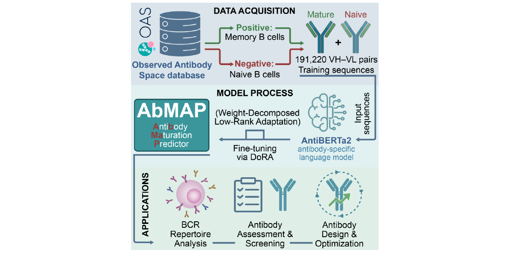

# AbMAP: antibody maturation predictor 🧬

[](https://opensource.org/licenses/Apache-2.0)
[](https://www.python.org/)
[](https://huggingface.co/wcc009/AbMAP)

**AbMAP (antibody maturation predictor)** is a deep-learning framework fine-tuned on the AntiBERTa2 protein language model using a Weight-Decomposed Low-Rank Adaptation (DoRA) strategy. Specifically trained on paired heavy–light (H–L) chain sequences from human naive and memory B cells, it captures the evolutionary patterns of antibody maturation to **accurately distinguish mature from naive H–L pairings**. AbMAP demonstrates exceptional robustness and generalization capabilities independently of sequence length variations, V-gene pairing preferences, and heterogeneous immunological contexts (external validation AUC = 0.970). By effectively correlating prediction scores with antibody specificity, affinity, overall developability, and clinical discontinuation risks , **AbMAP serves as a powerful high-throughput computational tool to optimize early-stage therapeutic antibody screening and design**.


---

## 📂 Repository Structure

```text
AbMAP/
├── data/                # Directory for input datasets (e.g., example.csv)
├── result/              # Directory for prediction outputs
├── environment.yml      # Conda environment configuration file
└── predict.py           # Main execution script for inference
````

-----

## 🛠️ Getting Started

### 1\. Installation & Environment Setup

To ensure reproducibility, we recommend using a `conda` virtual environment:

```bash
# Clone the repository
git clone https://github.com/wucc009/AbMAP.git
cd AbMAP

# Create and activate a dedicated environment
conda env create -f environment.yml
conda activate AbMAP
```

### 2\. Input Data Requirements

Input data must be provided in **CSV format** and strictly adhere to the following data standards:
1.  **Columns**: Must contain exactly `ID`, `VH_seq` (Heavy chain variable region sequence), and `VL_seq` (Light chain variable region sequence).
2.  **Integrity**: No missing values (NaN) are allowed.
3.  **Sequence Length**: The combined amino acid length of `VH_seq` and `VL_seq` per row must be **\<= 247**.

#### Data Example (`./data/example.csv`)

| ID | VH\_seq | VL\_seq |
| :--- | :--- | :--- |
| Naive1 | QITLKESGPTLVKPTQTLTL... | DIQMTQSPSSLSASVGDRVT... |
| Naive2 | QVQLVQSGAEVKKPGASVKV... | DVVMTQSPLSLPVTLGQPAS... |
| ... | ... | ... |
| Mature5 | QVQLVQSGAEVKKPGSSVKV... | EIVMTQSPATLSVSPGDRAT... |

-----

## 🚀 Running the Prediction

### Model

The AbMAP model is hosted on Hugging Face: [wcc009/AbMAP](https://huggingface.co/wcc009/AbMAP).

  * **Automatic Mode**: The script will automatically attempt to download the model from Hugging Face upon first execution.
  * **Manual Mode**: If the automatic download fails, please download the model manually and place it in the `./model/` directory.

### Execution Command

Upload your data to the `./data/` folder and run the following command (for example, using ./data/example.csv):

```bash
python predict.py ./data/example.csv
```

-----

## 📊 Results and Output

After inference, the results are saved in the `./result/` directory. The output includes the sequence ID and its predicted maturation status.

#### Output Example (`./result/result.csv`)

| ID | Prediction |
| :--- | :--- |
| Naive1 | Naive |
| Naive2 | Naive |
| ... | ... |
| Mature5 | Mature |

-----

## 📜 License

This project is licensed under the **Apache License 2.0**.

```text
Copyright 2026 Changchun Wu

Licensed under the Apache License, Version 2.0 (the "License");
you may not use this file except in compliance with the License.
You may obtain a copy of the License at

    [http://www.apache.org/licenses/LICENSE-2.0](http://www.apache.org/licenses/LICENSE-2.0)

Unless required by applicable law or agreed to in writing, software
distributed under the License is distributed on an "AS IS" BASIS,
WITHOUT WARRANTIES OR CONDITIONS OF ANY KIND, either express or implied.
See the License for the specific language governing permissions and
limitations under the License.
```

-----

## ✉️ Contact

For academic inquiries or technical support, please contact **Changchun Wu** via GitHub Issues.
